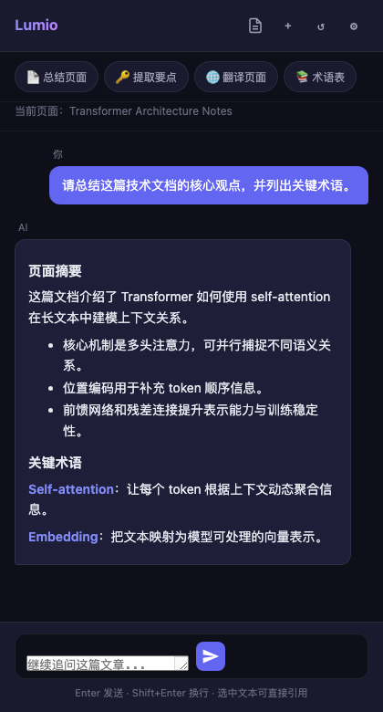
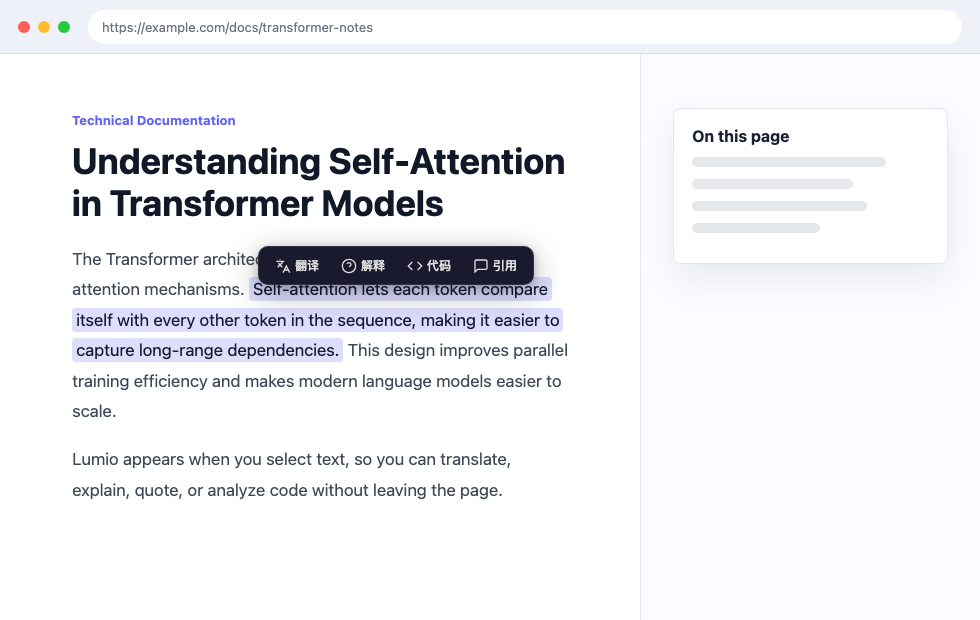
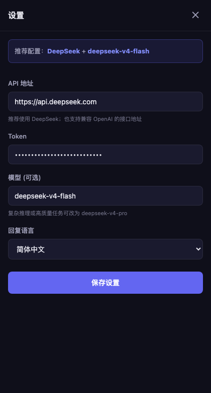

# Lumio

**中文** | [English](#english)

Lumio 是一个 Chrome 侧边栏 AI 阅读助手，面向技术文档、长文章和网页资料阅读。你可以在网页上划词翻译、解释概念、解释代码、总结当前页面、提取关键知识点、生成术语表，并在侧边栏里继续追问。

当前版本以中文体验为主，默认推荐使用 DeepSeek，也支持兼容 OpenAI Chat Completions 格式的其他 API 服务。

## 产品截图

### 侧边栏阅读助手



### 网页划词工具栏



### DeepSeek 推荐配置



## 功能特性

- 网页划词工具栏：翻译、解释、解释代码、引用到对话
- Chrome 侧边栏对话：自动提取当前页面上下文
- 页面级操作：总结页面、提取要点、翻译页面、生成术语表
- 代码块增强：在代码块上快速触发 AI 解释
- 右键菜单和快捷键支持
- 默认推荐 DeepSeek，用户自行配置 API 地址和 Token
- 设置和对话历史保存在浏览器本地 `chrome.storage.local`
- 无后端、无遥测、无内置数据采集

## 本地安装

1. 下载或 clone 本仓库。
2. 打开 Chrome，进入 `chrome://extensions`。
3. 打开右上角 **Developer mode / 开发者模式**。
4. 点击 **Load unpacked / 加载已解压的扩展程序**。
5. 选择本仓库目录。
6. 点击 Lumio 扩展图标，填写模型配置：
   - API 地址：`https://api.deepseek.com`
   - Token：你的 DeepSeek API Key
   - 模型：`deepseek-v4-flash`

本项目不需要构建步骤，直接加载源码目录即可。

## 使用方式

- 在网页上选中文本，使用浮动工具栏快速翻译或解释。
- 右键选中文本，选择 Lumio 的上下文菜单操作。
- 点击扩展图标或使用 `Cmd+Shift+Y` 打开侧边栏。
- 使用 `Cmd+Shift+T` 翻译当前选中文本。
- 在侧边栏顶部使用快捷操作总结页面、提取要点、翻译页面或生成术语表。

## 推荐模型配置

Lumio 默认推荐 DeepSeek：

- API 地址：`https://api.deepseek.com`
- 默认模型：`deepseek-v4-flash`
- 更高质量选项：`deepseek-v4-pro`

`deepseek-v4-flash` 适合日常阅读、翻译、总结和解释，速度和成本更适合作为默认模型。遇到复杂技术文章、长文推理或更高质量要求时，可以改用 `deepseek-v4-pro`。

不建议新用户继续配置 `deepseek-chat` 或 `deepseek-reasoner`，因为 DeepSeek 已公告这些旧模型名会在 2026-07-24 停用。

## API 兼容性

Lumio 从扩展的 background service worker 向你配置的 API 地址发送请求。请求体格式如下：

```json
{
  "model": "deepseek-v4-flash",
  "messages": [
    { "role": "system", "content": "..." },
    { "role": "user", "content": "..." }
  ],
  "max_tokens": 4096
}
```

如果填写的是 base URL，Lumio 会自动补全 chat completions 路径：

- `https://api.deepseek.com` 会变成 `https://api.deepseek.com/chat/completions`
- 其他 OpenAI 风格 base URL 通常会补成 `/v1/chat/completions`

返回解析支持 OpenAI 风格的 `choices[0].message.content`，也兼容少数简单文本返回格式。

## 权限说明

Lumio 请求以下 Chrome 扩展权限：

- `activeTab`：用户主动调用 Lumio 时访问当前标签页
- `storage`：保存本地设置和对话历史
- `sidePanel`：在 Chrome 侧边栏显示助手
- `contextMenus`：添加右键菜单操作
- `http://*/*` 和 `https://*/*`：在普通网页注入划词工具栏，并提取可读页面内容

Lumio 不会在 `chrome://`、`about:`、本地文件 URL 或其他扩展页面上运行。

## 隐私说明

Lumio 是一个本地浏览器扩展，不包含分析 SDK、遥测、广告脚本或内置后端服务。

当你使用总结、翻译、解释或对话功能时，Lumio 可能会把选中文本、页面内容摘要、页面标题/URL 和对话消息发送到你自己配置的 API 服务商。API 地址、Token、模型、语言偏好和对话历史保存在 Chrome 扩展本地存储中。

详细说明见 [PRIVACY.md](PRIVACY.md)。

## 项目结构

```text
.
├── background.js          # Service worker、消息路由、AI API 调用
├── content/               # 网页 content script 和划词工具栏样式
├── docs/screenshots/      # README 产品截图
├── icons/                 # 扩展图标
├── manifest.json          # Chrome Extension Manifest V3
├── popup/                 # 扩展弹窗
├── sidepanel/             # 侧边栏 UI 和对话逻辑
└── tools/                 # 截图生成用的本地静态页面
```

## 开发

这是一个原生 Chrome 扩展项目，开发流程很轻：

1. 修改源码。
2. 打开 `chrome://extensions`。
3. 点击 Lumio 卡片上的 reload 按钮。
4. 如果改了 content script，刷新目标网页。

发布前建议手动验证：

- 首次设置流程
- 划词工具栏
- 右键菜单
- 侧边栏对话
- 页面总结
- 对话历史

## 路线图

- 流式响应
- 常用服务商预设
- 设置和对话导入/导出
- 更完善的 Markdown 渲染
- 按网站启用/禁用
- 消息路由和 Markdown 渲染测试

## 许可证

MIT License. See [LICENSE](LICENSE).

---

## English

Lumio is a Chrome side-panel AI reading assistant for technical docs, long-form articles, and web pages. It helps you translate selected text, explain concepts, explain code, summarize the current page, extract key points, generate glossaries, and continue asking follow-up questions in the side panel.

The current version is optimized for a Chinese-first experience. DeepSeek is the recommended default provider, while other OpenAI-compatible Chat Completions APIs are also supported.

## Screenshots

### Side Panel Assistant


### Selection Toolbar


### DeepSeek Settings


## Features

- Floating toolbar for selected text: translate, explain, explain code, quote to chat
- Chrome side-panel chat with page context extraction
- Page-level actions: summarize page, extract key points, translate page, generate glossary
- Code block enhancement with one-click code explanation
- Context menu and keyboard shortcuts
- DeepSeek as the recommended default provider
- Local-only settings and conversation history through `chrome.storage.local`
- No backend, no telemetry, no bundled analytics

## Local Installation

1. Download or clone this repository.
2. Open Chrome and go to `chrome://extensions`.
3. Enable **Developer mode**.
4. Click **Load unpacked**.
5. Select this repository directory.
6. Click the Lumio icon and configure:
   - API URL: `https://api.deepseek.com`
   - Token: your DeepSeek API key
   - Model: `deepseek-v4-flash`

No build step is required.

## Usage

- Select text on a web page and use the floating toolbar.
- Right-click selected text and choose a Lumio action.
- Open the side panel from the extension icon or `Cmd+Shift+Y` on macOS.
- Use `Cmd+Shift+T` on macOS to translate selected text.
- Use the side-panel quick actions to summarize, translate, or extract terms from the current page.

## Recommended Model Settings

Lumio recommends DeepSeek for the default setup:

- API URL: `https://api.deepseek.com`
- Default model: `deepseek-v4-flash`
- Higher-quality option: `deepseek-v4-pro`

`deepseek-v4-flash` is recommended for everyday reading, translation, summarization, and explanation because it is fast and cost-effective. Use `deepseek-v4-pro` for more complex technical content or higher-quality reasoning.

The legacy model names `deepseek-chat` and `deepseek-reasoner` are not recommended for new configurations because DeepSeek has announced that they will be deprecated on 2026-07-24.

## API Compatibility

Lumio sends requests from the extension background service worker to the configured endpoint. The request body is:

```json
{
  "model": "deepseek-v4-flash",
  "messages": [
    { "role": "system", "content": "..." },
    { "role": "user", "content": "..." }
  ],
  "max_tokens": 4096
}
```

If the API URL is a base URL, Lumio automatically appends the chat completions path:

- `https://api.deepseek.com` becomes `https://api.deepseek.com/chat/completions`
- Other OpenAI-style base URLs normally become `/v1/chat/completions`

The response parser supports OpenAI-style `choices[0].message.content` and a few simple text response formats.

## Permissions

Lumio requests these Chrome extension permissions:

- `activeTab`: access the current tab when the user invokes Lumio
- `storage`: store local settings and conversation history
- `sidePanel`: show the assistant in Chrome's side panel
- `contextMenus`: add right-click actions
- `http://*/*` and `https://*/*`: inject the selection toolbar and extract readable page content on normal web pages

Lumio does not run on `chrome://`, `about:`, file URLs, or extension pages.

## Privacy

Lumio is a local browser extension. It does not include analytics, telemetry, advertising scripts, or a bundled backend service.

When you ask Lumio to summarize, translate, explain, or chat, the selected text, extracted page context, conversation messages, and page title/URL may be sent to the API endpoint you configure. API token, API URL, model setting, language preference, and conversation history are stored locally in Chrome extension storage.

See [PRIVACY.md](PRIVACY.md) for details.

## Project Structure

```text
.
├── background.js          # Service worker, message routing, AI API calls
├── content/               # Page content script and injected toolbar styles
├── docs/screenshots/      # Product screenshots used by README
├── icons/                 # Extension icons
├── manifest.json          # Chrome Extension Manifest V3
├── popup/                 # Extension popup
├── sidepanel/             # Side panel UI and chat logic
└── tools/                 # Local static pages used to generate screenshots
```

## Development

Because this is a vanilla Chrome extension, development is reload-based:

1. Edit files.
2. Open `chrome://extensions`.
3. Click the reload button for Lumio.
4. Reopen or refresh the target page if content script changes were made.

Before publishing, manually verify:

- First-run settings flow
- Selected text toolbar
- Context menu actions
- Side panel chat
- Page summary
- Conversation history

## Roadmap

- Streaming responses
- Provider presets
- Export/import settings and conversations
- Better Markdown rendering
- Per-site enable/disable controls
- Tests for message routing and Markdown rendering

## License

MIT License. See [LICENSE](LICENSE).
